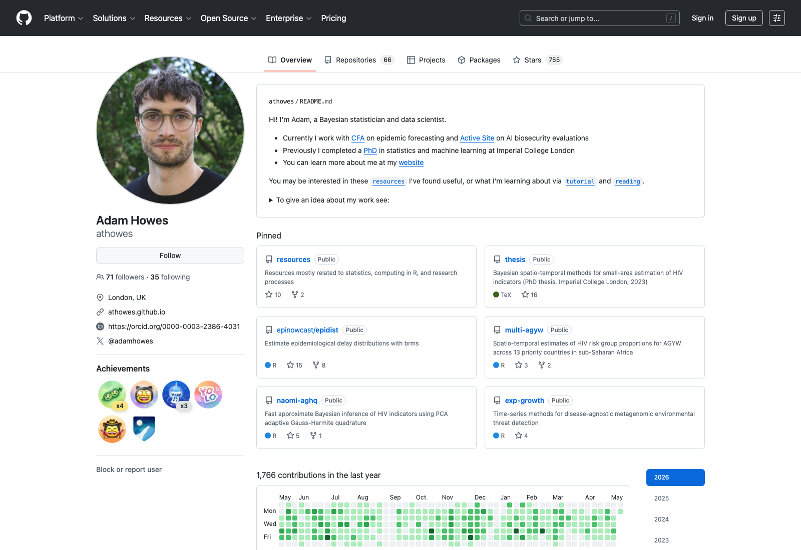
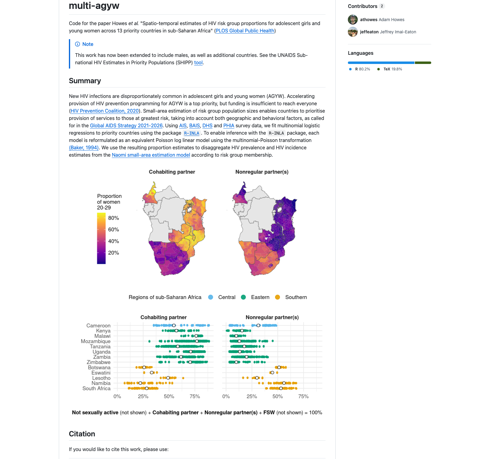
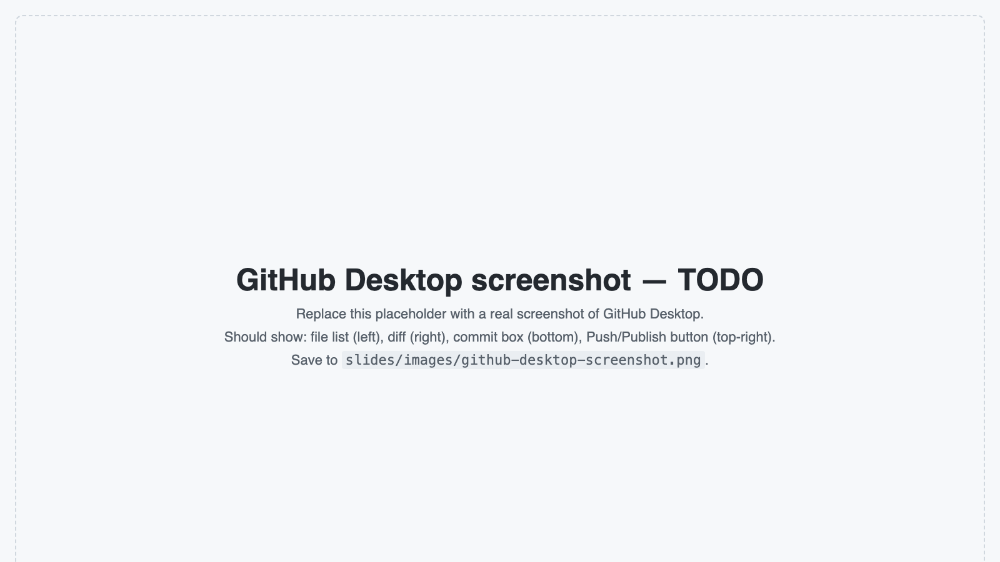

# Framing {.section}

## What you will leave with

By the end of this session:

1. A **GitHub profile** with a short personal README — your "academic landing page".
2. **One of your current projects** organised as a public repo with a clear README, one figure, and a short description.

Both linkable from your CV.

::: aside
This is not a software engineering bootcamp. It is a starter pattern you can use this week.
:::

## End state, concretely

Two artefacts. Both public. Both yours.

::: {.columns}
::: {.column width="50%"}
**Profile**

<https://github.com/athowes>

A short bio, links, pinned repositories. Renders automatically from a special repo.
:::
::: {.column width="50%"}
**Project**

<https://github.com/athowes/multi-agyw>

Title, summary, key figure, file structure, citation, contact. One screen.
:::
:::

## Why bother?

Three audiences. Each gives a reason.

. . .

- **Future you**. Six months from now you will re-open this folder and have no idea what you did.

. . .

- **Your supervisor, examiner, or collaborator**. Increasingly normal to be asked: "can I see the code?"

. . .

- **Your career**. A public repo with a clean README is a free, durable artefact. It shows up when people search your name.

## What this workshop is not

We are not going to:

- Make you a software engineer.
- Cover Git's full feature set (branches, merges, conflicts).
- Build a personal website (your profile page does most of the work).
- Argue about whether to use the terminal (we will not).

We **are** going to give you a viable starter pattern. You can extend it later.

# What good looks like {.section}

## A polished profile

{.r-stretch fig-align="center"}

::: aside
Source: <https://github.com/athowes>. We are using this as the aspirational example.
:::

## A polished project README

{.r-stretch fig-align="center"}

::: aside
Source: <https://github.com/athowes/multi-agyw>. This is the model for hands-on 3.
:::

## Anatomy of a good project README

A single page covering:

1. **Title** + one-line description
2. **Summary**: what is the question, method, finding (2–4 sentences)
3. **One figure** — usually the key result
4. **File structure**: where to find what
5. **Reproducibility notes**: software versions, data sources
6. **Citation + contact + licence**

That is it. Aim for one screen.

# GitHub Desktop: mental model {.section}

## The four things you need to picture

::: {.columns}
::: {.column width="50%"}
**1. Working directory**
Your actual project folder on your laptop.

**2. Local repository**
Git's hidden history of snapshots, inside that folder (`.git/`).
:::
::: {.column width="50%"}
**3. Remote repository**
A copy on github.com.

**4. The loop**
Edit → commit (snapshot) → push (upload).
:::
:::

::: aside
GitHub Desktop hides most of this. But knowing the picture helps when something feels confusing.
:::

## The minimum viable loop

```
        [your laptop]                  [github.com]

   working directory ──► commit ──► push ──► remote repo
        ▲                                         │
        │                                         │
        └─────────────── pull ────────────────────┘
```

In English:

- **Commit** = save a labelled snapshot, locally.
- **Push** = send your snapshots to GitHub.
- **Pull** = download snapshots from GitHub (useful if you work on two machines or with collaborators).

## What GitHub Desktop looks like

{.r-stretch fig-align="center"}

::: aside
Tour: changed files on the left, diff on the right, commit box at the bottom, push button top-right.
:::

## A 30-second demo

Five clicks to learn:

1. **File → New repository** (creates a local repo)
2. Edit a file in your folder. GitHub Desktop shows the diff.
3. Write a **commit message** ("first commit"). Click **Commit**.
4. Click **Publish repository** to push to github.com.
5. View it in your browser.

That is the entire loop. Everything else is a variation.

# Hands-on 1: profile README {.section}

## The "username/username" trick

::: {.callout-tip title="The one piece of magic"}
If you create a repository whose name is **exactly your GitHub username**, the `README.md` inside it appears automatically at the top of your profile page.

Example: GitHub user `aallorant` creates a repo called `aallorant`. The README in that repo renders at <https://github.com/aallorant>.
:::

No website. No hosting. No extra steps.

## Your task (15 minutes) {.smaller}

In GitHub Desktop:

1. **File → New repository**. Name it exactly your GitHub username. Tick "initialize with a README".
2. **Publish** to GitHub. Make it **public**.
3. Open `README.md` in any text editor.
4. Use `templates/profile-readme-template.md` from the workshop repo as a starting point.
5. Fill in: who you are, what you research, links to your work, contact.
6. **Commit** ("draft profile README") and **push**.
7. Visit `github.com/your-username` in a browser. See it rendered.

## Markdown crash course

| You type | What it renders |
| --- | --- |
| `# Heading 1` | Big header |
| `## Heading 2` | Smaller header |
| `**bold**` | **bold** |
| `*italic*` | *italic* |
| `[link text](url)` | [link text](https://example.com) |
| `` | embedded image |
| `` `code` `` | `code` |
| `- bullet` | bullet list |

That is 90% of what you need.

## Checklist before moving on

- [ ] Repo named exactly your username
- [ ] Public
- [ ] README has: name, role, 2–3 sentence research summary, 2+ links, contact
- [ ] Pushed and visible at `github.com/your-username`

If you ticked all four, you are done with hands-on 1. **Put up a hand or send a message in chat if stuck.**

# Hands-on 2: push a project {.section}

## Your task (10 minutes)

Pick **one project** of yours. A current paper, a dissertation chapter, an analysis. It does not need to be clean.

1. In GitHub Desktop: **File → New repository**. Point it at your project folder.
2. **Commit** the existing files with the message "initial commit".
3. **Publish** to GitHub. Keep it **private** for now; we will add the README before making it public.

::: {.callout-warning title="Before you commit"}
Check the changed-files panel. If you see raw data files, large files, or anything sensitive: **right-click → "Ignore file"** before committing. We will cover `.gitignore` in detail in two slides.
:::

## What to gitignore

Always:

- `data/` if it contains anything you did not generate yourself
- `.DS_Store`, `Thumbs.db` (OS junk)
- `.Rhistory`, `.RData` (R session files)
- `__pycache__/`, `*.pyc` (Python compiled files)
- Any file with credentials, API keys, or passwords

GitHub Desktop has built-in templates (`Repository → Repository settings → Ignored files`). Pick R, Python, or both.

## Folder structure that ages well

```
your-project/
├── data/          ← raw inputs (often gitignored)
├── code/          ← scripts, in run order
├── output/        ← figures, tables, model outputs
├── docs/          ← methods notes, supplementary
├── README.md      ← the front door
├── .gitignore     ← what Git should ignore
└── LICENSE        ← reuse terms (add later)
```

You do not have to restructure your project now. Just know the pattern.

# Hands-on 3: project README {.section}

## Think (3 min, solo)

If a stranger landed on your project repo, what would they need to see in one page to understand your work?

Jot down 4–6 bullet points. No writing yet.

::: aside
Resist the urge to start typing markdown. Just think.
:::

## Pair / share (4 min)

Turn to a neighbour (in person) or your assigned partner (online).

Exchange your bullet points. Ask:

- What did *you* prioritise?
- What did *they* prioritise?
- What's missing from yours?

Update your list.

## Write (13 min)

In your project repo:

1. Open `README.md` (create it if it does not exist).
2. Use `templates/project-readme-template.md` as a starting point.
3. Fill in: title, summary, **one figure**, file structure, methods/data notes, contact.
4. Save. **Commit** ("draft project README"). **Push**.
5. **Switch the repo to public** (Repository → Repository settings on GitHub).
6. View it rendered on github.com.

## Checklist before moving on

- [ ] Title and one-line description
- [ ] 2–4 sentence summary
- [ ] One figure embedded
- [ ] File structure described (3–5 lines)
- [ ] Data and methods noted
- [ ] Contact info
- [ ] Repo is public
- [ ] You can scroll the rendered README on github.com

# Closing notes {.section}

## Licensing in 30 seconds

| What you have | What to add |
| --- | --- |
| Code | **MIT** (permissive, simple) or **GPL-3.0** (copyleft) |
| Non-code (slides, text, figures) | **CC-BY-4.0** (attribution required) |
| Nothing | All rights reserved by default — others legally cannot reuse your work |

Just add a `LICENSE` file. GitHub has a one-click tool: **Add file → Create new file → name it `LICENSE` → "Choose a license template"**.

## Sensitive data

::: {.callout-important title="Never commit"}
- Personally identifiable data (PII)
- Restricted-use data (DHS, secure ONS data, anything under a DUA)
- Credentials, API keys, passwords
- Large binary files (>100 MB)
:::

If your `code/` reads from `data/`, **gitignore `data/`**. Document in the README where the data came from and how a reader can request it. Ship a small synthetic sample if reproducibility matters.

If you accidentally commit something sensitive: stop, do not push, ask for help.

## What we did not cover (and where to go next)

- **Branches and pull requests** — for collaboration. [GitHub Docs: branches](https://docs.github.com/en/pull-requests).
- **GitHub Pages** — host a project site with a custom URL. [pages.github.com](https://pages.github.com).
- **Zenodo + GitHub releases** — get a citable DOI for your code. [guides.github.com/activities/citable-code](https://guides.github.com/activities/citable-code/).
- **Issues** — a personal todo list, attached to the project.
- **GitHub Education** — free private repos and other perks if you sign up with your `.ac.uk` email. [education.github.com](https://education.github.com).

## Final checklist

You should now have:

- [x] GitHub Desktop installed and signed in
- [x] A public profile README at `github.com/your-username`
- [x] A public project repo with a real README
- [x] A figure in that README
- [x] The vocabulary to learn more

::: {.callout-tip}
**This week**: add the profile URL to your CV. Make one more repo public. Or just leave it. You have done the hard part.
:::

## Questions

Open floor.

If we are done early, stay and work on your repos. I am here.

